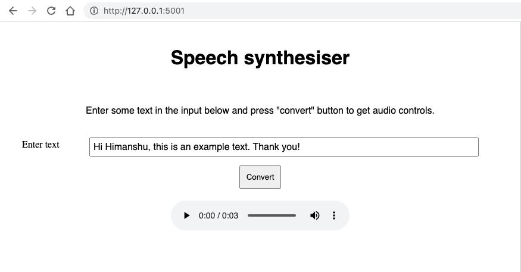

# Sample website to demonstrate TTS

The project uses Flask framework to locally host a static HTML website. The backend calls Google Cloud Text to Speech API to convert the text to audio. 

## 1. Project setup

### 1.1 Setting up Google Cloud API credentials. 

Follow the guide [here](https://cloud.google.com/text-to-speech/docs/before-you-begin) to setup GCP project, creating service account for TTS API, and downloading the JSON keys. The JSON keys are required by the Python Google Cloud API.

After downloading the JSON, set the GOOGLE_APPLICATION_CREDENTIALS environment variable

`$ export GOOGLE_APPLICATION_CREDENTIALS=<PATH_TO_JSON_FILE>`

### 1.2 Setting up conda environment

Create conda environment with Python 3.9

`$ conda create -n tts_demo python==3.9`

Activate the conda environment

`$ conda activate tts_demo`

Install the required packages for the project from requirements.txt

`$ pip install -r requirements.txt`

## 2. Running the app

Go to the directory containing the app.py file and run the following commands. Use the same terminal instance where you have exported the GOOGLE_APPLICATION_CREDENTIALS environment variable.

```
$ export FLASK_DEBUG=1
$ export FLASK_ENV=development
$ flask run --port=5001
```

You should now be able to access the website on http://127.0.0.1:5001. After converting text to audio, the audio controls on the webpage will allow you to play and download the audio file.

## 3. Expected output

After entering some text and clicking on convert, your output should look like this:

